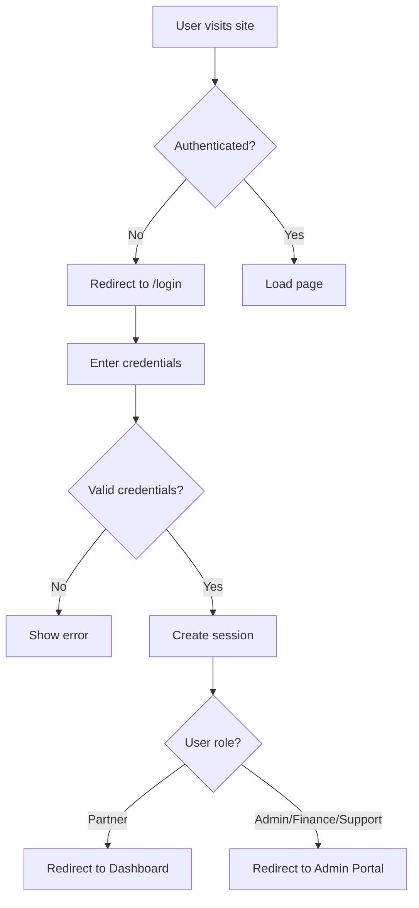

# Authentication System Guide

## Overview

The Interconnect & Roaming Solution now includes a comprehensive authentication system with role-based access control (RBAC) for different types of users.

## 🔐 User Roles

The system supports four distinct user roles:

### 1. **ADMIN** (System Administrator)
- **Full platform access**
- Can manage all partners
- Access to admin portal
- Can view fraud monitoring
- Can manage all invoices and disputes
- Color badge: Red

### 2. **PARTNER** (Partner Organization)
- **Partner-specific access**
- View their own dashboard and analytics
- Upload TAP files
- View invoices
- Create and manage disputes
- Color badge: Blue

### 3. **FINANCE** (Finance Manager)
- **Financial operations access**
- Manage invoices
- Handle disputes
- View partner information
- Access fraud monitoring
- Color badge: Green

### 4. **SUPPORT** (Customer Support)
- **Support operations access**
- View and manage disputes
- View partner information
- Limited administrative access
- Color badge: Purple

## 👥 Demo User Accounts

### Admin Accounts

| Role | Email | Password | Access |
|------|-------|----------|--------|
| System Admin | admin@interconnect.com | admin123 | Full platform access |
| Finance Manager | finance@interconnect.com | finance123 | Invoices & Disputes |
| Customer Support | support@interconnect.com | support123 | Dispute Management |

### Partner Accounts

| Partner | Email | Password | Partner Code |
|---------|-------|----------|--------------|
| Verizon Wireless | roaming@verizon.com | verizon123 | USAVZ1 |
| T-Mobile UK | wholesale@tmobile.uk | tmobile123 | GBRTM1 |
| NTT Docomo | intl@nttdocomo.jp | docomo123 | JPNDO1 |

## 🚀 How to Use

### Accessing the Login Page

Navigate to: **http://localhost:3000/login**

### Quick Login (Demo Mode)

The login page includes a "Show Demo Credentials" button that displays all available demo accounts. You can:
1. Click "Show Demo Credentials"
2. Click any account card to auto-fill credentials
3. Click "Sign In" to log in

### Manual Login

1. Enter email address
2. Enter password
3. Click "Sign In"
4. You'll be redirected based on your role:
   - **Admin/Finance/Support** → Admin Portal
   - **Partner** → Partner Dashboard

## 🎨 Features

### Navigation Bar
- **User Menu**: Shows logged-in user's name and role
- **Avatar Badge**: Color-coded by role
- **Role-Based Navigation**: Only shows menu items accessible to your role
- **Last Login Display**: Shows your last login timestamp
- **Quick Dashboard Access**: Partners can quickly access their dashboard

### Protected Routes

Routes are automatically protected based on user roles:

| Route | Admin | Partner | Finance | Support |
|-------|-------|---------|---------|---------|
| Home | ✓ | ✓ | ✓ | ✓ |
| Partners | ✓ | ✗ | ✓ | ✓ |
| Dashboard | ✓ | ✓ | ✓ | ✗ |
| Invoices | ✓ | ✓ | ✓ | ✗ |
| Disputes | ✓ | ✓ | ✓ | ✓ |
| Fraud Monitor | ✓ | ✗ | ✓ | ✗ |
| Admin Portal | ✓ | ✗ | ✗ | ✗ |

### Session Management

- **Persistent Sessions**: Login state is saved in localStorage
- **Auto-Logout**: Click "Sign Out" in the user menu
- **Session Restoration**: Automatically restored on page refresh
- **Secure Logout**: Clears all session data

## 🔧 Technical Implementation

### Files Created

1. **Authentication Context**
   - `lib/context/AuthContext.tsx` - React context for auth state

2. **Type Definitions**
   - `lib/types/auth.ts` - User and authentication types

3. **Mock Database**
   - `lib/mock-data/users.ts` - Demo users and authentication logic

4. **Components**
   - `app/login/page.tsx` - Login page with demo credentials
   - `components/layout/ProtectedRoute.tsx` - Route protection wrapper
   - `components/layout/ClientLayout.tsx` - Auth provider wrapper
   - `components/layout/Navigation.tsx` - Updated with user menu

### Authentication Flow



### Role-Based Access Control

```typescript
// Example: Protecting a route
<ProtectedRoute allowedRoles={['ADMIN', 'FINANCE']}>
  <InvoicesPage />
</ProtectedRoute>
```

### Using Auth in Components

```typescript
import { useAuth } from '@/lib/context/AuthContext';

function MyComponent() {
  const { user, isAuthenticated, logout } = useAuth();

  if (!isAuthenticated) {
    return <div>Please log in</div>;
  }

  return <div>Welcome, {user?.name}!</div>;
}
```

## 🎯 User Experience

### Partner Users
1. **Login** → Automatically redirected to their dashboard
2. **Dashboard** → View traffic, revenue, and SLA metrics for their network
3. **Upload TAP Files** → Submit usage data for billing
4. **View Invoices** → See billing details and line items
5. **Manage Disputes** → Create and track billing disputes

### Admin Users
1. **Login** → Access admin portal
2. **Manage Partners** → Approve, suspend, or activate partners
3. **Monitor System** → View platform health and metrics
4. **Review Fraud Alerts** → Investigate anomalies
5. **Financial Oversight** → Monitor revenue and invoices

### Finance Users
1. **Login** → Access financial tools
2. **Manage Invoices** → View and process billing
3. **Handle Disputes** → Review and resolve financial disputes
4. **Monitor Partners** → View partner financial data
5. **Fraud Detection** → Review security alerts

### Support Users
1. **Login** → Access support tools
2. **Manage Disputes** → Review and resolve customer issues
3. **View Partner Info** → Access partner details for support
4. **Communication** → Handle partner inquiries

## 🔒 Security Features

### Current Implementation
- ✓ Role-based access control
- ✓ Session management with localStorage
- ✓ Protected routes with automatic redirection
- ✓ Password-based authentication
- ✓ User activity tracking (last login)

### Production Recommendations
- 🔄 Replace localStorage with secure HTTP-only cookies
- 🔄 Implement JWT token-based authentication
- 🔄 Add password hashing (bcrypt)
- 🔄 Implement OAuth 2.0 for external providers
- 🔄 Add multi-factor authentication (MFA)
- 🔄 Rate limiting on login attempts
- 🔄 Session timeout and refresh tokens
- 🔄 Audit logging for authentication events
- 🔄 HTTPS enforcement
- 🔄 CSRF protection

## 📱 UI Components

### Login Page Features
- Clean, modern design with gradient background
- Email and password fields with validation
- Loading states during authentication
- Error messaging for invalid credentials
- **Demo credentials display** with quick-login buttons
- Color-coded account cards by role
- Responsive layout

### User Menu Features
- User name and role display
- Avatar with role-based color
- Last login timestamp
- Quick dashboard link (for partners)
- Logout button
- Dropdown with click-outside-to-close

### Navigation Features
- Dynamic menu items based on role
- Active route highlighting
- Role-based menu filtering
- User avatar in navigation bar
- Smooth transitions and animations

## 🎨 Styling & Design

### Color Scheme
- **Admin**: Red badge, red accents
- **Partner**: Blue badge, blue accents
- **Finance**: Green badge, green accents
- **Support**: Purple badge, purple accents

### Visual Hierarchy
- Large, readable headings
- Clear call-to-action buttons
- Color-coded status indicators
- Consistent spacing and padding
- Professional gradient backgrounds

## 🧪 Testing the System

### Test Scenario 1: Admin Login
1. Go to http://localhost:3000/login
2. Use admin@interconnect.com / admin123
3. Should redirect to /admin
4. Should see all navigation items
5. Should see "System Administrator" in user menu

### Test Scenario 2: Partner Login
1. Go to http://localhost:3000/login
2. Use roaming@verizon.com / verizon123
3. Should redirect to /dashboard with Verizon's data
4. Should only see Home, Dashboard, Invoices, Disputes in navigation
5. Should see "Verizon Wireless" in user menu

### Test Scenario 3: Session Persistence
1. Log in as any user
2. Refresh the page
3. Should remain logged in
4. User info should persist

### Test Scenario 4: Protected Routes
1. Try accessing /admin without logging in
2. Should redirect to /login
3. Log in as a partner
4. Try accessing /admin
5. Should show "Access Denied" or redirect

### Test Scenario 5: Logout
1. Log in as any user
2. Click user avatar in navigation
3. Click "Sign Out"
4. Should redirect to /login
5. Should clear session data

## 📊 Permissions Matrix

### Navigation Access

| Permission | Admin | Partner | Finance | Support |
|-----------|-------|---------|---------|---------|
| Home | ✓ | ✓ | ✓ | ✓ |
| Partners List | ✓ | ✗ | ✓ | ✓ |
| Partner Details | ✓ | Own Only | ✓ | ✓ |
| Dashboard | ✓ | Own Only | ✓ | ✗ |
| Invoices | ✓ | Own Only | ✓ | ✗ |
| Disputes | ✓ | Own Only | ✓ | ✓ |
| Fraud Monitor | ✓ | ✗ | ✓ | ✗ |
| Admin Portal | ✓ | ✗ | ✗ | ✗ |

### Actions

| Action | Admin | Partner | Finance | Support |
|--------|-------|---------|---------|---------|
| Create Partner | ✓ | ✗ | ✗ | ✗ |
| Update Partner Status | ✓ | ✗ | ✗ | ✗ |
| Upload TAP File | ✓ | ✓ | ✗ | ✗ |
| Create Invoice | ✓ | ✗ | ✓ | ✗ |
| Create Dispute | ✓ | ✓ | ✓ | ✓ |
| Resolve Dispute | ✓ | ✗ | ✓ | ✓ |
| View Fraud Alerts | ✓ | ✗ | ✓ | ✗ |
| Investigate Fraud | ✓ | ✗ | ✓ | ✗ |

## 🚀 Quick Start Commands

```bash
# Start the development server
npm run dev

# Access the application
# http://localhost:3000

# Login page
# http://localhost:3000/login

# Test accounts available in "Show Demo Credentials"
```

## 📝 Notes

- **Demo Mode**: The "Show Demo Credentials" feature is designed for easy testing and demonstration
- **Production**: Remove or hide this feature in production environments
- **Passwords**: All demo passwords follow the pattern `{role}123` for easy remembering
- **Session Storage**: Currently using localStorage - migrate to secure cookies for production
- **No Database**: Authentication is currently mock-based - integrate with a real database for production

## 🎓 Best Practices Implemented

✓ Role-based access control (RBAC)
✓ Protected routes with automatic redirection
✓ User-friendly error messages
✓ Loading states during authentication
✓ Persistent sessions
✓ Clean logout functionality
✓ Responsive design
✓ Intuitive user interface
✓ Color-coded roles for quick identification
✓ Quick access to relevant features per role

## 🔮 Future Enhancements

- [ ] Password reset functionality
- [ ] Email verification
- [ ] Two-factor authentication (2FA)
- [ ] Single sign-on (SSO)
- [ ] API key management for partners
- [ ] Session timeout warnings
- [ ] Remember me functionality
- [ ] Login history and audit logs
- [ ] IP whitelisting
- [ ] Brute force protection

---

**Authentication System Status**: ✅ FULLY FUNCTIONAL
**Access URL**: http://localhost:3000/login
**Demo Mode**: Enabled with quick-login options
